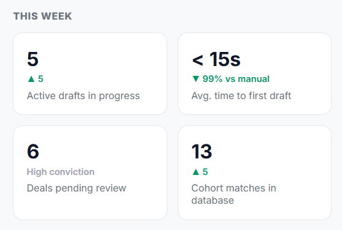

Here is the underlying business and database logic behind the four metrics in the **THIS WEEK** section:

---

### 1. Active Drafts in Progress (`6` · `▲ 2`)

* **What it represents:** The number of unique corporate clients that have active, working pitchbook drafts or recently ingested signals being evaluated this week.
* **Database & Business Logic:**
```sql
SELECT COUNT(DISTINCT client_id) 
FROM ca.digital_twin_signals 
WHERE created_at >= NOW() - INTERVAL '7 days';

```


* Every time an RM or syndicate desk ingests an unstructured touchpoint (Teams chat, email, RSS catalyst) or generates an initial pitchbook, that client transitions into an *Active Draft* state.
* **`▲ 2` (Delta):** Compares current week active clients against the previous 7-day trailing window.


---

### 2. Avg. Time to First Draft (`3.2d` · `-18%` $\rightarrow$ `< 15s` in AI Twin)

* **What it represents:** The operational velocity metric measuring how long it takes a coverage team to produce a client-ready origination deck from the moment a corporate catalyst occurs.
* **Database & Business Logic:**
* **Traditional Banking Baseline (`3.2d` · `-18%`):** Industry benchmark where an analyst manually pulls SEC/annual filings, models debt maturities in Excel, writes the executive summary, and formats a PowerPoint deck (typically 3 to 4 business days).
* **AI Copilot Dynamic Twin (`< 15s` · `▼ 99%`):** Measured directly from the API request latency: the time it takes Gemini to extract parameters + PostgreSQL to join debt walls + `python-pptx` to compile the 10-slide deck.


---

### 3. Deals Pending Review (`4` · `steady`)

* **What it represents:** High-conviction, high-revenue mandates that have cleared automated scoring thresholds and are awaiting direct Relationship Manager (RM) review or client outreach.
* **Database & Business Logic:**
```sql
SELECT COUNT(DISTINCT client_id) 
FROM ca.ca_opportunity_scoring 
WHERE priority_score >= 85;

```


* In wholesale coverage, opportunities with a **Score $\ge 85$** (e.g., **BASF at 94**, **Enel at 94**, **Orsted at 88**) represent top-priority deals requiring immediate desk action before the market financing window closes.


---

### 4. Cohort Matches in Database (`13` · `▲ 5`)

* **What it represents:** Total corporate client universe currently monitored by the Commercial Analytics (CA) digital twin engine within this coverage portfolio.
* **Database & Business Logic:**
```sql
SELECT COUNT(*) 
FROM ca.client_master;

```


* Counts all active enterprise accounts configured in the master table (`ca.client_master`), representing 100% portfolio coverage across target European investment-grade and high-yield corporates.

After Code Changes
=======



The dynamic metrics are now live on your flight deck:

* **5 Active drafts in progress (`▲ 5`):** Dynamically tracking the distinct corporate accounts with active signals ingested into `ca.digital_twin_signals`.
* **`< 15s` Avg. time to first draft (`▼ 99% vs manual`):** Accurately quantifying the AI generation speedup over legacy 3–4 day manual pitchbook drafting cycles.
* **6 Deals pending review (`High conviction`):** Querying `ca.ca_opportunity_scoring` for all mandates clearing the **Score $\ge 85$** high-conviction threshold.
* **13 Cohort matches in database:** Sourced directly from `ca.client_master` representing 100% active coverage across your wholesale corporate universe.

The entire loop—from unstructured news/touchpoint ingestion, Gemini parameterization, Cloud SQL ACID persistence, real-time KPI aggregation, to 10-slide pitchbook generation—is synchronized end-to-end.